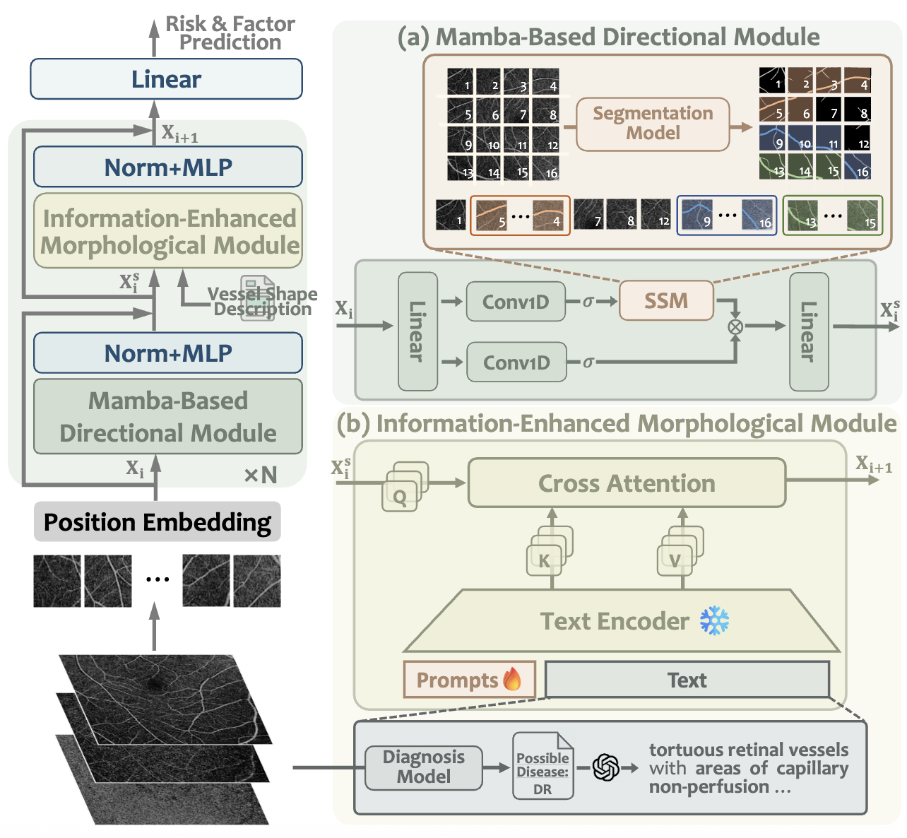

# VAMPIRE

VAMPIRE: a novel multi-purpose paradigm of CVD risk assessment that jointly performs CVD risk and CVD-related condition prediction, aligning with clinical experiences.

## Overview
VAMPIRE extracts crucial vascular characteristics through two key components: 
- a Mamba-Based Directional (MBD) Module that captures fine-grained vascular trajectory features 
- an Information-Enhanced Morphological (IEM) Module that incorporates comprehensive vessel morphology knowledge.

<div align="center">

</div>

## Data Preparation

### Vessel Direction Traverse

- Setup

  [SAM-OCTA](https://github.com/ShellRedia/SAM-OCTA) is employed to generate initial vessel maps. Please set up the environment accordingly and download the pretrained weights to `vessel_traverse/sam_weights`.

- Segmentation

  ```shell
  cd vessel_traverse
  python test_sam_octa.py
  ```

  Then, the vessel segmentation map would be saved into `seg` directory.

- Patch Ordering

  ```shell
  python process_mask.py
  ```

  Then, we can obtain `img2order.pkl`, which records the traverse order for each OCTA scan.

### Vessel Morphology Description

We first employ a classification model trained on the [OCTA-500](https://ieee-dataport.org/open-access/octa-500) dataset to identify potential retinal diseases. 

Subsequently, we prompt GPT-4o with the diagnostic results to generate descriptions on possible vascular morphologies. The prompt can be referred to `vessel_descrp/disease_prompts.json`.

Our generated description can be found in `vessel_descrp/p2res_disease.json`.

## Environment Setup

- Create Environment

  ``` shell
  conda create -n vampire python=3.9.21 -y
  conda activate vampire
  pip install torch==1.13.1+cu116 torchvision==0.14.1+cu116 torchaudio==0.13.1 --extra-index-url https://download.pytorch.org/whl/cu116
  pip install numpy==1.21.6
  pip install scikit-learn==1.2.2
  pip install transformers==4.47.1
  ```

- Install Mamba
  
  Mamba requirements `causal_conv1d` and `mamba-1p1p1` are built from [Vim](https://github.com/hustvl/Vim)

- Prepare pretrained weights

  We use pretrained fundus weights from [VisionFM](https://github.com/ABILab-CUHK/VisionFM). Please first download the [weights](https://drive.google.com/file/d/13uWm0a02dCWyARUcrCdHZIcEgRfBmVA4/view) and save into the `pretrain` directory.

## Model Training

```shell
python finetune.py
```

